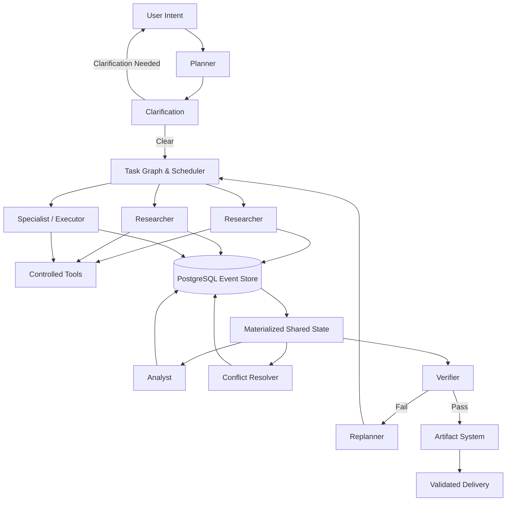

<div align="center">

# NEXUS

### Autonomous Intelligence — From Intent to Execution

<p>
  <strong>
    A multi-agent orchestration system that transforms user intent into
    coordinated planning, parallel execution, recovery, verification,
    and validated deliverables.
  </strong>
</p>

<br/>

<p>
  <a href="#-overview">Overview</a> •
  <a href="#-architecture">Architecture</a> •
  <a href="#-features">Features</a> •
  <a href="#-quick-start">Quick Start</a> •
  <a href="#-contributing">Contributing</a>
</p>

<br/>


<br/>

**Plan → Parallelize → Execute → Observe → Adapt → Verify → Deliver**

</div>

---

## 🧠 Overview

Most AI systems are designed around generating an answer.

**NEXUS is designed around accomplishing an objective.**

A user's intent can require research, analysis, external tools, multiple independent tasks, intermediate state, recovery from failures, and verification before anything should be considered complete.

NEXUS provides an orchestration layer that coordinates specialized AI agents through a shared, event-sourced state rather than chaining conversations together.

```text
User Intent
     │
     ▼
  Planner
     │
     ▼
 Task Graph
     │
     ├──────────────┬──────────────┐
     ▼              ▼              ▼
Researcher      Researcher      Specialist
     │              │              │
     └──────────────┴──────────────┘
                    │
                    ▼
              Shared State
                    │
                    ▼
                 Analyst
                    │
                    ▼
               Verification
                    │
              ┌─────┴─────┐
              │           │
             Pass        Fail
              │           │
              ▼           ▼
           Deliver      Replan
                          │
                          └──────► Execute
```

### Core idea

> **Agents coordinate through shared state, not through conversation chains.**

The LLMs reason about tasks and decisions, while deterministic infrastructure controls state transitions, concurrency, permissions, events, tool execution, and verification.

---

# ⚡ Features

## 🎯 Intent → Task Graph

NEXUS converts natural-language objectives into structured task graphs.

Tasks can contain:

- dependencies
- agent roles
- required tools
- execution constraints
- verification requirements

The planner also handles ambiguity instead of blindly inventing user intent.

```text
                ┌── Clear Intent ──► Task Graph
User Intent ────┤
                └── Ambiguous ─────► Clarification
```

---

## ⚡ Parallel Agent Execution

Independent tasks are executed concurrently while dependencies are respected.

For example:

```text
                   ┌── Research Python ──┐
                   │                     │
User Objective ────┼── Research Go ──────┼──► Analyst
                   │                     │
                   └── Research Rust ────┘
```

The scheduler, not the LLM, controls actual concurrency.

This keeps the execution deterministic and prevents agents from independently deciding how shared state or concurrency should be mutated.

---

## 🧩 Specialized Agents

NEXUS separates responsibilities across specialized roles:

| Agent | Responsibility |
|---|---|
| **Planner** | Converts intent into a task graph |
| **Researcher** | Gathers information using controlled tools |
| **Analyst** | Processes and synthesizes evidence |
| **Specialist** | Performs domain-specific work and artifact generation |
| **Conflict Resolver** | Resolves conflicting factual claims |
| **Replanner** | Creates recovery plans |
| **Verifier** | Independently validates results |

Different roles can use different LLM providers and models through the routing layer.

---

## 🔧 Controlled Tool Execution

Agents interact with external capabilities through a controlled tool layer.

Examples include:

- HTTP fetching
- Calculator
- Artifact generation

Tool execution provides:

- permissions
- bounded execution
- provenance
- failure classification
- event recording

Agents don't receive unrestricted access to the environment.

---

## 🗃️ Event-Sourced Shared State

The event log is the authoritative source of truth.

Agents do not directly overwrite shared state.

Instead:

```text
Agent
  │
  ▼
Event
  │
  ▼
Event Store
  │
  ▼
Projection
  │
  ▼
Shared State
```

This enables:

- auditability
- reproducibility
- provenance
- deterministic replay
- state reconstruction

A completed run can be reconstructed from its event history.

---

## 🔄 Failure → Recovery

Failures are treated as information rather than simply terminating execution.

When a recoverable task fails:

```text
Tool Failure
     │
     ▼
Task Failure
     │
     ▼
Failure Classification
     │
     ▼
Replanner
     │
     ▼
Replacement Task
     │
     ▼
Continue Execution
```

NEXUS distinguishes between failures that can be meaningfully recovered from and infrastructure/provider failures that should fail honestly.

For example:

```text
Provider Rate Limit
        │
        ▼
Provider Failure
        │
        ▼
Fail Honestly
```

A provider outage should not cause the planner to invent an unrelated alternative task.

---

## ⚔️ Conflict Resolution

When agents produce conflicting factual claims, NEXUS can detect and resolve them.

```text
Researcher A ──► Claim A ──┐
                           ├──► Conflict Detector
Researcher B ──► Claim B ──┘
                                  │
                                  ▼
                           Conflict Resolver
                                  │
                                  ▼
                           Verified Evidence
```

Original evidence remains available for provenance and auditability.

---

## 🔍 Independent Verification

Producing an answer and verifying that answer are separate responsibilities.

The verifier can receive:

- the original objective
- relevant facts
- evidence
- generated artifacts
- deterministic verification results

```text
Generated Result
       │
       ▼
Deterministic Checks
       │
       ▼
Semantic Verification
       │
   ┌───┴───┐
   ▼       ▼
 PASS     FAIL
   │       │
   ▼       ▼
Deliver  Recover
```

The verifier does not simply trust an agent's summary.

---

## 📦 Artifact Generation & Delivery

NEXUS can generate files and multi-file project artifacts as part of a task.

Artifact handling includes:

- path traversal protection
- secret scanning
- file and artifact size limits
- SHA-256 checksums
- provenance
- validation
- deterministic packaging
- controlled downloads
- artifact supersession during recovery

A repaired artifact can replace an earlier failed version without deleting its history.

```text
Artifact v1
     │
     ▼
Verification Failure
     │
     ▼
Recovery
     │
     ▼
Artifact v2
     │
     ▼
Verification Pass
     │
     ├──► v2 = Current Deliverable
     │
     └──► v1 = Superseded
```

---

# 🏗️ Architecture



### Architectural principles

| Principle | Purpose |
|---|---|
| **Append-only events** | Authoritative source of truth |
| **Materialized state** | Efficient agent context |
| **Explicit task graph** | Clear dependencies |
| **Deterministic scheduler** | Controlled concurrency |
| **Controlled tools** | Bounded execution |
| **Provenance** | Traceable evidence |
| **Independent verification** | Prevent blind trust |
| **Recovery / replanning** | Adapt to failures |
| **Artifact validation** | Safe deliverables |

---

# 🔌 LLM Routing

NEXUS uses an OpenAI-compatible provider abstraction so different roles can use different models.

Example configuration:

```text
Planner        → Groq
Researcher     → Gemini
Analyst        → Gemini
Specialist     → Gemini
Replanner      → Groq
Verifier       → Groq
```

The exact models/providers are configurable through environment variables.

This allows role-specific routing based on:

- structured output support
- tool-calling behavior
- cost
- latency
- availability
- task requirements

> **Never commit API keys or other secrets to the repository.**

---

# 🧪 Real-World Validation

NEXUS has been validated through real LLM and tool executions rather than relying exclusively on mocked tests.

A representative successful execution:

```text
                    User Objective
                          │
                          ▼
                       Planner
                          │
            ┌─────────────┼─────────────┐
            ▼             ▼             ▼
      Research Python  Research Go  Research Rust
            │             │             │
            └─────────────┼─────────────┘
                          │
                          ▼
                    Shared State
                          │
                          ▼
                       Analyst
                          │
                    Calculator
                          │
                          ▼
                     Specialist
                          │
                    Artifact Write
                          │
                          ▼
                      Verifier
                          │
                          ▼
                  Verified Deliverable
```

A final real validation demonstrated:

- 3 independent Researcher tasks
- actual concurrent execution
- real HTTP fetching
- real calculator calls
- shared event-sourced state
- tool provenance
- independent verification
- artifact generation
- SHA-256 integrity verification
- event replay
- frontend state matching backend events
- successful final completion

---

# 🛠️ Tech Stack

## Backend

- Python
- FastAPI
- PostgreSQL
- SQLAlchemy
- Pydantic
- pytest

## AI / Orchestration

- OpenAI-compatible LLM abstraction
- Multiple LLM providers
- Structured model outputs
- Task graph scheduler
- Event-sourced state
- Controlled tool execution
- Recovery / replanning
- Independent verification

## Frontend

- React
- TypeScript
- Vite
- Tailwind CSS

## Infrastructure

- PostgreSQL
- Redis / RQ where required
- Local artifact workspace

---

# 📁 Project Structure

```text
NEXUS/
│
├── backend/
│   ├── app/
│   │   ├── agents/
│   │   ├── api/
│   │   ├── artifacts/
│   │   ├── events/
│   │   ├── llm/
│   │   ├── recovery/
│   │   ├── state/
│   │   ├── tools/
│   │   └── verification/
│   │
│   ├── migrations/
│   ├── tests/
│   └── ...
│
├── frontend/
│   ├── src/
│   │   ├── api/
│   │   ├── components/
│   │   ├── hooks/
│   │   ├── pages/
│   │   └── ...
│   └── ...
│
├── docs/
├── docker-compose.yml
├── .env.example
└── README.md
```

---

# 🚀 Quick Start

## Prerequisites

You'll need:

- Python 3.x
- Node.js
- PostgreSQL
- Git

Depending on the enabled infrastructure, Redis may also be required.

---

## 1. Clone

```bash
git clone https://github.com/<your-username>/<your-repository>.git
cd NEXUS
```

---

## 2. Configure Environment

Create your local environment file:

```bash
cp .env.example .env
```

Configure the required:

- database connection
- LLM provider keys
- provider/model routing
- tool configuration

**Never commit `.env`.**

---

## 3. Backend

```bash
cd backend
```

Run database migrations:

```bash
alembic upgrade head
```

Start the FastAPI application using the project's configured server command.

---

## 4. Frontend

```bash
cd frontend
npm install
npm run dev
```

The frontend communicates with the NEXUS backend API.

---

# 🧪 Testing

NEXUS contains tests covering:

- event sourcing
- state reconstruction
- task graphs
- scheduler concurrency
- agent runtime
- tool execution
- tool permissions
- provenance
- recovery
- replanning
- conflict resolution
- clarification
- verification
- policy gates
- artifact safety
- artifact generation
- artifact delivery
- artifact supersession
- frontend run states

During development, prefer focused test suites for the subsystem being changed.

Run the broader test suite before merging substantial architectural changes.

---

# 🗺️ Roadmap

NEXUS is intentionally scoped around reliable multi-agent orchestration rather than attempting to become a general-purpose autonomous AGI system.

Potential future directions include:

- [ ] richer execution visualizations
- [ ] additional tool integrations
- [ ] more provider/model adapters
- [ ] stronger verification strategies
- [ ] improved artifact/project workflows
- [ ] additional recovery strategies
- [ ] more sophisticated scheduling policies
- [ ] persistent cross-run learning
- [ ] additional domain-specific agent capabilities

Future contributions should preserve the core principle:

> **Deterministic infrastructure controls execution; agents reason about the work.**

---

# 🤝 Contributing

NEXUS is **open to contributions**.

Contributions are welcome across:

- 🎨 Visual design & frontend UX
- 🧠 Agent architecture
- ⚙️ Orchestration & scheduling
- 🔧 Tool integrations
- 🔍 Verification
- 🔄 Recovery strategies
- 📦 Artifact workflows
- 🧪 Testing
- 📚 Documentation
- 🚀 Developer experience

## Before starting a significant change

Please open an issue or discussion describing **what you want to work on**.

A good contribution request could look like:

> **Frontend / Visual Design**  
> I'd like to redesign the execution visualization to make parallel agent activity easier to understand while preserving the existing backend contracts.

or:

> **Architecture**  
> I'd like to propose an improvement to the task scheduling system that supports [specific capability]. I would like to discuss the design before implementing it.

or:

> **Tool Integration**  
> I'd like to add support for [tool/API] and make it available to selected agent roles.

or:

> **Verification**  
> I'd like to add a verification strategy for [specific type of output] while keeping the existing verifier architecture intact.

or:

> **Developer Experience**  
> I'd like to improve the local setup/documentation/testing workflow for contributors.

### Contribution proposals should ideally include

- **What** you want to change
- **Why** it is useful
- **Where** in NEXUS it belongs
- **How** you intend to approach it
- Whether it changes existing behavior
- Any compatibility or migration concerns

---

## 🎨 Frontend Contributions

The frontend is intentionally open to experimentation.

Ideas include:

- execution visualizations
- agent/workspace representations
- interactive task graphs
- responsive layouts
- animations
- accessibility
- dark/light themes
- result presentation
- artifact previews
- improved onboarding

However, frontend changes should consume the **existing backend contracts** wherever possible.

If a UI idea appears to require backend changes, please discuss the change first rather than modifying backend behavior solely to support a visual implementation.

---

## 🧠 Architecture Contributions

Architecture contributions are welcome, but significant changes should be discussed before implementation.

NEXUS relies heavily on:

- append-only events
- deterministic state transitions
- explicit task dependencies
- controlled concurrency
- provenance
- independent verification

Proposed architectural changes should explain how these guarantees are preserved.

---

## 🐛 Bug Reports

When reporting a bug, please include:

1. What you expected to happen
2. What actually happened
3. Steps to reproduce
4. Relevant logs/events
5. Environment information
6. Whether the issue is reproducible

For orchestration issues, including the relevant run ID and event sequence is especially useful.

---

# 📜 License

This project is licensed under the MIT License.

See [`LICENSE`](LICENSE) for details.

---


<div align="center">

### From Intent to Execution.

**NEXUS**

</div>